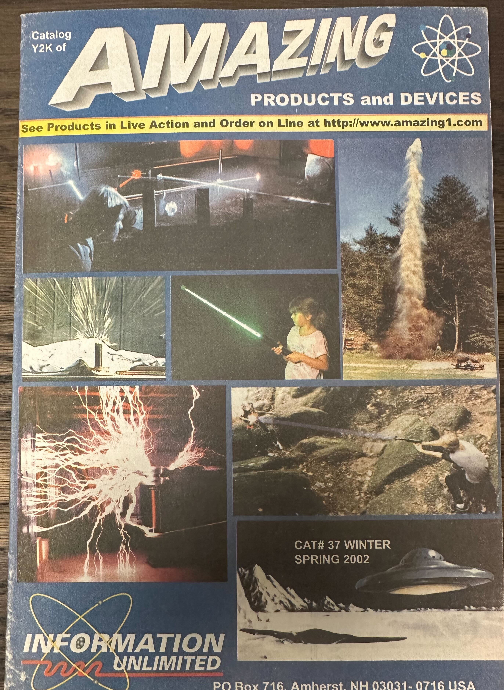

---
title: Verdens farligste postordrebutikk
description: Ionepistol for hvermansen
---

80-tallet var et ekstremt kjedelige tiår (riktignok marginalt med interessant enn 70-tallet). Den første offentlig tilgjengelige internettforbindelsen kom ikke før i 1991, så det var nada streaming, ingen sosiale medier, telefoner hadde ledning, og det kostet mye penger å ringe til noen utenfor byen du bodde i.

Det fantes heldigvis flere hobbybutikker, der man kunne kjøpe modellflybyggesett og ganske innholdsrike kjemisett (kjemi var ikke "farlig" den gangen), men hvis man gikk lei av å krasje modeller man hadde brukt måneder på å bygge, eller fikk kjeft for å sette fyr på barnerommet, så var man stort sett begrenset til aktiviteter som å sykle til kompisen, gå på kino eller lese.

Heldigvis hadde George Lucas lansert [Star Wars](https://www.imdb.com/title/tt0076759/?ref_=nv_sr_srsg_1_tt_7_nm_0_in_0_q_star%2520wa) i 1977, og noen år senere så lanserte president [Ronald Reagan](https://en.wikipedia.org/wiki/Ronald_Reagan) sin egen versjon av Star Wars i form av [SDI](https://en.wikipedia.org/wiki/Strategic_Defense_Initiative). Begge var vel strengt tatt science fiction. Den første laget for å underholde og den andre for å drive Sovjetunionen inn i et våpenkappløp, som de ikke hadde råd til å være med på.

Anyways.

For oss som kjedet vettet av oss i dette tiåret, så satte begge disse hendelsene fantasien ettertrykkelig i sving. Etter å ha sett lasere og lyssverd på film, og hørt _seriøse_ politikere snakke på TV om partikkelstrålevåpen, railguns og nøytronbomber på TV, så blir jo det nysgjerrige barnesinn inspirert. Man vil jo helst kunne bygge sin egen versjon, som man så kan imponere venner og bekjente med.

Det fantes som forventet _ingen_ informasjon om disse temaene i hyllene på biblioteket, men heldigvis så hadde bladkiosken Narvesen på den tiden et enormt utvalg av blader og magasiner fra det store utland. Når jeg kjedet meg, men hadde penger, så syklet jeg gjerne ned til Narvesen for å se om det hadde dukket opp et nytt nummer av ["Mad"](https://en.wikipedia.org/wiki/Mad_(magazine)), ["Cracked"](https://en.wikipedia.org/wiki/Cracked_(magazine)), ["Model Airplane News"](https://membership.modelairplanenews.com/), ["Popular Science"](https://www.popsci.com/) eller ["Popular Mechanics"](https://www.popularmechanics.com/). Unge hjerner trenger stimuli og alternativene fotball eller religion var uaktuelle for mitt vedkommende.

Noe av det mest spennende i de to siste bladene var reklamene bak i bladene. Jeg fant blant annet reklame for en bokklubb som het ["TAB Books"](https://en.wikipedia.org/wiki/TAB_Books) i USA. Dette var en bokklubb for makere lenge før [Dale Dougherty](https://en.wikipedia.org/wiki/Dale_Dougherty) lanserte ["MAKE: Magazine"](https://makezine.com/) i 2005. 

I 1983, så la jeg merket til at de reklamerte for en bok som het ["Build Your Own Laser, Phaser, Ion Ray Gun & Other Working Space Age projects"](https://ia801508.us.archive.org/3/items/BuildYourOwnLaserPhaserIonRayGunAndOtherWorkingSpaceAgeProjectsRobertE.Iannini/Build%20Your%20Own%20Laser%2C%20Phaser%2C%20Ion%20Ray%20Gun%20and%20Other%20Working%20Space%20Age%20Projects%20%28Robert%20E.%20Iannini%29.pdf). Det var en rimelig omstendelig prosess å melde seg inn. Jeg tror internasjonale svarfrimerker, skranker i postkontor og postanvisninger med sirlig signatur var involvert (ikkono internett. Ikkeno minibank. Penger var fysiske og du hadde _bankbok_ der det sto hvor mye du hadde klart å spare. For å få cash, så måtte man dra til banken, legge bankboka på skranken og si hvor mye man ønsket å ta ut. Sedler ble så sirlig talt opp og overlevert. Å handle ting fra utlandet var ingen triviell affære.,

Men, - jeg klarte det og boka ankom til slutt.

Dette var ulikt alt annet jeg hadde sett i bokform før og det var litteratur som kjørte fletta av alt de hadde på biblioteket (Kanskje med unntak av [Tesla-biografien fra 1944](https://www.amazon.com/Prodigal-Genius-Life-Nikola-Tesla/dp/1596057130) jeg hadde lånt gjennom bibloteket og utgaven av ["Colorado Springs Notes"](https://www.scribd.com/doc/335469/Nikola-Tesla-s-Colorado-Springs-Notes) i biblioteksinnbinding, som jeg hadde lyktes i å bestille med god hjelp av damen i engelskavdelingen på [Bruns bokhandel](https://no.wikipedia.org/wiki/F._Bruns_Bokhandel) i Trondheim).

Dette var bedre enn sci-fi. Det var sci-fi i praksis! D.v.s. sci-fi-dingser man kunne _bygge_ - hvis man fikk tak i komponentene. Kondensatorer og dioder som var ratet for 20kV var ikke akkurat noe du fikk tak i over disk hverken hos [Omega verksted](https://www.omegav.ntnu.no/) eller på bakrommet til firmaet jeg har glemt navnet på, men som holdt til i de gamle lokalene til [Edda Radiofabrikk](https://snl.no/Edda_radiofabrikk) i Elgeseter gate i Trondheim.

Jeg oppdaget en del år senere at forfatteren bak boka ([Robert Iannini](https://www.wired.com/2013/01/information-unlimited/)) drev det som Wired Magazine omtalte, som ["mannen bak postordrebutikken for verdens farligste elektronikkbyggesett"](https://www.wired.com/2013/01/information-unlimited/). Dvs ["Information Unlimited"](https://web.archive.org/web/20230718194519/https://www.amazing1.com/)(Wayback machine, så treg link). Iannini døde i 1983 i en alder av 85 år, og da ble også websjappa [amazing1.com](https://web.archive.org/web/20230718194519/https://www.amazing1.com/) lagt ned. Jeg har fremdeles en av katalogene derfra, og den er fremdeles spennende å bla i.

Nå ser jo verden litt anderledes ut og alt av komponenter og materialer er bare et tastetrykk unna. Jeg bestemte meg derfor for å bygge en av Iannini sine kreasjoner til [Trondheim Skaperfest](https://www.skaperfest.no/) for et par år siden.
Kretsen er rimelig enkel, og baserer seg på at man genererer høyspenning ved å drive primærsiden på en flybacktrafo (uten innebygget likeretter) med et par transistorer. Man jorder så enden av sekundærspolen og kjører så "lavspent"-siden (ca 20000V) inn in [Cockroft Walton multiplier](https://en.wikipedia.org/wiki/Cockcroft%E2%80%93Walton_generator) for å booste spenninga til et for alle andre praktiske formål enn en ione-"pistol" smått absurd potensiale. Hvis denne biten ikke støpes inn i parafinvoks eller epoxy, så vil du ha [corona](https://en.wikipedia.org/wiki/Corona_discharge) (ionelekkasje) all over og det ender gjerne med at kretsen ødelegger seg selv.

Man terminerer hele greia i en synål, og feltet i tuppen på denne vil være såpass intenst at du får en mer eller mindre kontrollert ionelekkasje ut fra spissen. Disse ionene er såpass mobile at du kan peke innretningen på venner og bekjente for å lade dem opp, slik at de får støt neste gang de tar i noe annet. Kanskje etter å ha spurt dem om lov først.

Siden jeg er litt lat, så valgte jeg å handle en ferdig bygget 200W [ZVS driver fra AliExpress](https://www.aliexpress.com/w/wholesale-200W-zvs-driver.html) for å drive primærsiden av flybacktrafoen. Jeg brukte ferrit-kjernen fra en død flyback fra et CO2 laser powersupply, 3D printet min egen bobbin og viklet så noen tusen runder med 0.2mm lakkisolert kobbertråd. Jeg gjorde så en kjapp test for å dra streamere med denne for å danne meg et inntrykk av utspenninga (ca 10000V/cm). Denne ble så støpt inn i epoxy.
Cockroft-Walton kretsen ble montert inne i et akrylrør, som så ble fylt med 2-komponent silikon fra [FormX.eu](https://formx.eu/)

Noen 3D-printede deler og et slaktet Super8-kamera (fra Fretex) senere og vi hadde den første prototypen.

Operatøren her har på gummihansker, siden "lavspent"-siden på ca 20000V AC er litt dårlig isolert ned mot avtrekkeren, så man får gjerne noen små RF-brannsår fra streamere på avtrekkerfingeren hvis man er litt uheldig.
