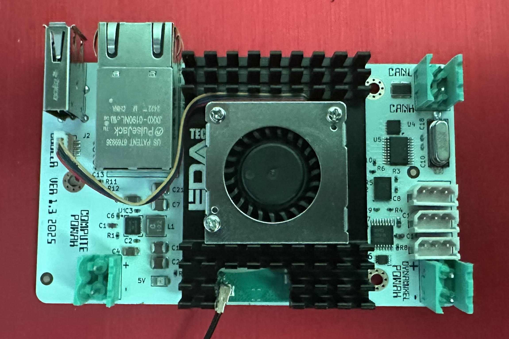

Hvis du noen gang har prøvd å bygge en liten robot, starter du gjerne med en Arduino og et servoshield. Kanskje legger du til en IMU også.
Det begynner uskyldig – men raskt ender du opp med et lite kråkereir av ledninger, og sjansen er stor for at roboten havner på hylla før den rekker å ta sine første skritt.

**Been there. Done that.**

I tillegg til den mekaniske kompleksiteten, blir også programvaren fort krevende. Skal du for eksempel bygge en selvbalanserende robot på to hjul, trenger du både en PID-kontroller og en presis IMU. Det lar seg absolutt gjøre med en Arduino eller annen mikrokontroller – men du vil raskt merke at det blir lite prosesseringskraft igjen til alt det andre.

Bygger du i stedet en edderkopplignende robot, slipper du å tenke på balanse – men må plutselig håndtere inverse kinematics. Vil du simulere bevegelsene, må du lære deg forward kinematics. Før du vet ordet av det, har du vurdert å bruke ROS, og du sitter og prøver å få liv i kode du fant på GitHub – kode som du egentlig ikke helt forstår, og som slett ikke passer roboten du selv har bygget.

Resultatet? Enda en robotstatuett på hylla.

**Been there. Done that.**

***

### Billige servoer – dyre erfaringer

For de fleste hobbybyggere er budsjettet begrenset, og da frister det å kjøpe de billigste servoene man finner – som oftest modellflyservoer med PWM-styring.
Men disse har som regel ingen encoderfeedback, så du vet ikke nøyaktig hvor servoarmen faktisk står, eller om den i det hele tatt nådde posisjonen du ba om. I tillegg er de gjerne upresise, både mekanisk og elektronisk.

Når du bygger roboter med mange ledd, oppdager du fort at 95 % av budsjettet forsvinner i servoer – og frustrasjonen følger tett på.

***

### Ønskelisten

Etter å ha vært gjennom dette noen ganger, ønsket jeg meg en kontroller som kunne løse flere av disse problemene på en elegant måte.
En kontroller som:

* har **nok prosesseringskraft** til å håndtere en kompleks robot.
* støtter **flere programmeringsspråk enn C og C++** (jeg har en forkjærlighet for Go).
* støtter **Dynamixel-protokollen** for smarte servoer.
* støtter **CAN-baserte robotservoer** (som Xiaomi CyberGear og lignende).
* har **innebygd IMU**.
* **kjører Linux** – med mulighet for realtime-kjerne eller CPU-pinning for sanntidskrav.
* samler alt som ellers ville vært en stabel med shields og ledningskaos i én kompakt løsning.
* har **Ethernet** (lav latenstid), slik at man enkelt kan koble på f.eks. en Nvidia Jetson for maskinlæring eller bildebehandling.
* er **enkel å fjernstyre**, enten med en Bluetooth-gamepad eller en RC-treningsdongle.

***

### Resultatet: Overlord

Overlord er et forsøk på å destillere alle disse erfaringene ned til én plattform – et solid, fleksibelt og moderne kontrollhjerte for alt fra små edderkopper til humanoide roboter.
Målet er å gjøre det morsomt å bygge roboter igjen – uten at prosjektet ender som et kråkereir av kabler og halvferdig kode på hylla.

Den er selvfølgelig open source. Du finner KiCad-filer, PDF skjema, boot config, eksempelkode for IMU, CAN, Dynamixel og gamepad på [https://github.com/hansj66/overlord](https://github.com/hansj66/overlord).

Hackaday: [A Robot Controller With The Compute Module 5](https://hackaday.com/2025/08/06/a-robot-controller-with-the-compute-module-5/).

