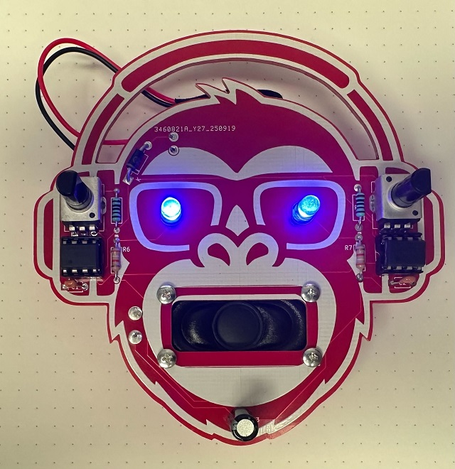

## Noen ord om lodding før man begynner

Ta en titt på spissen på loddebolten. Hvis den er svart, så vil urenhetene skape en barriere for varmen, det blir da nærmest umulig for elevene å lodde.

Loddebolten _blir_ møkkete hver gang man lodder. Derfor er det viktig at mand drar spissen på loddebolten over en fuktig loddesvamp, eller dytter den gjennom loddeull i messing etter hver lodding. Det vil hjelpe for å holde den ren.

Hvis hverken loddeull eller loddesvamp hjelper, så finnes det noe som heter "Tip Activator" (selges hos Mouser, DigiKey og andre). Dette er en miks av loddetinn og kjemikalier som fjerner oksideringen på en skitten loddebolt. Man varmer opp bolten, påfører Tip Activator og venter noen sekunder før man så bruker loddesvamp eller loddeull igjen. Dette må kanskje gjentas noen ganger før spissen blir helt ren igjen og klar til bruk

### Hvordan lodde

Loddebolten må være oppvarmet til korrekt temperatur før man begynner. Hvis dere har en loddebolt med temperaturkontroll, så still temperaturen på 370 grader. Dette er langt over smeltetemperaturen til loddetinnet (og også over maksimal temperatur som de fleste komponenter tåler), men det gjør at den nødvendige berøringstiden blir mye kortere. Dette er blikevel mer skånsomt for komponentene enn om man bruker svært lang tid med lavere temperatur.

Uansett hvilken komponent man skal , så må man passe på at spissen på loddebolten berører _både_ pinnen på komponenten og kobberet på kretskortet _samtidig_. Hold spissen inntil, mens man forsiktig fører loddetinnet bort til de to varme delene. Når begge er varme nok, så flyter tinnet som en film, som drar seg over både kobber på kretskortet og pinnen som skal loddes fast.

Hvis loddingen likevel skulle vise seg å være vanskelig så kan det lønne seg å påføre en dråpe fluks. Dette fungerer som en varmespreder og gjør at loddetinnet flyter lettere.

### Avtrekk

Enkelte loddetinn leveres med en kjerne av fluks. Dette smelter sammen med loddetinnet og forenkler loddeprosessen, men det kan dannes litt røyk/lukt i prosessen. God ventilasjon eller mekanisk avtrekk ved loddestasjonen eliminerer dette.

### Blyholdig loddetinn

EU sitt RoHS-direktiv setter begrensninger på hvor mye bly elektriske komponenter kan inneholde. Det er innført et generelt forbud mot bruk av blyholdig loddetinn etter 2006 (med enkelte få unntak for industri, i tilfeller der det ikke finnes andre alterniv). 

## Byggeveiledning

Nødvendig utstyr før du begynner

1. Loddebolt og loddetinn
2. Liten avbitertang ("side cutter")
3. Stjerneskrujern
4. Batterier

## Batterier og lyd

"Red Monkey" er bråkete. Hvor høy lyd byggesettet lager når det er ferdig er avhengig av spenningen på batteriet du velger å bruke. Lav spenning gir lav lyd og høy spenning gir høy lyd.

Det minste batteriet du kan bruke er 4.5V (Lyden er da ganske lav). Den absolutt største batteripakken du kan bruke er 15 V (Lyden er da ekstremt høy). 9V er "sånn passe" mht lydnivå, men læreren din er kanskje uenig i dette.

> Høyere spenning enn 15V vil ødelegge flere av komponentene på kortet.

## Litt om komponentene du kommer til å bruke

### Faste Motstander

Fargekoden til disse sier noe om hvilken verdi de har i ohm ("Ohm" Etter Georg Ohm). Jo høyere verdi de har, jo mindre strøm slipper de gjennom.
Kretskortet er merket med "R" + et tall der de faste motstandene skal loddes fast.

> Eksempel: En motstand på 0 ohm gir ingen motstand. En motstand på 200 ohm slipper gjennom halvparten så mye strøm som en motstand på 100 ohm. Jo høyere verdi, jo mindre strøm slipper gjennom motstanden.

R1,R2, R6 og R7 i dette settet er faste motstander. Det har ingenting å si hvilken vei disse monteres på kretskortet.

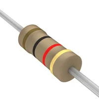

### Variable motstander

Disse kalles også for "potentiometer". Dette er motstander der du kan variere hvor mye strøm som slipper gjennom. Eksempelivs, så kan et potentiometer på 100kOhm varieres mellom 0 ohm og 100kOhm ved at man skrur på knotten på potentiometeret. Det er slike du kan bruke til å kontrollere hva slags lyder som Red Monkey lager.

R1 og R2 er variable motstander.

Disse har 5 pinner, og de passer bare en vei på kretskortet.

### Kondensatorer

Tenk på disse som en "bøtte" du kan lagre strøm i. De fungerer nesten som et batteri. De kan lades opp og de kan lades ut.

Kondensatorer kommer i forskjellige størrelser, former og fasonger. Verdien på en kondensator angis i F ("Fahrad". Til ære for Michael Fahraday)

Det har ingenting å si hvilken vei C1 og C2 monteres på kretskortet (keramiske kondensatorer), men C3 (elektrolyttkondensator) må montere slik at pinnen merket "-" monteres i hullet for "-" og pinnen merket "+" monteres i hullet for "+" (som regel er bare enten "-" eller "+" merket på kondensatoren)

|Keramisk kondensator|Elektrolyttkondensator|
|-|-|
|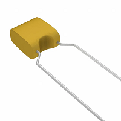||

### Dioder

Dette er komponenter som bare leder strøm en vei. Vi kan bruke en sånn for å beskytte kretskortet hvis man ved et uhell skulle koble batteriet feil vei. 

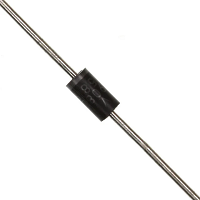

### LEDS

Disse kalles også for lysdioder. De fungerer på samme måte som en vanlig diode, men de lyser også. Disse må monteres riktig vei for at de skal virke. Legg merke til at de har en rett kant på siden. Dette er også merket på kretskortet. Pass på at den rette kanten på dioden er på samme side som den rette kanten på merkingen på kretskortet

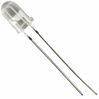

### Integrerte kretser

Dette er komponenter som har andre komponenter inni seg. Det er takket være slike at vi har TV, internett og datamaskiner (blant mye annet). Det er takket være disse at du kan bruke flere timer om dagen på å doom-scrolle på telefonen din.

555 er en gammel integrert krets som gjør en eneste ting. Det er en krets som kan telle. Den har 8 bein og litt avhengig av hva man kobler til de 8 beinene, så kan du få den til å telle på veldig mange forskjellige måter - blant annet, så kan du bruke den til å lage lyder, som du så kan plage venner, lærere eller foreldre med.

Det er _VELDIG_ viktig at den monteres riktig vei. Den har et lite hakk i siden, eller en liten prikk. Dette viser hva som er pinne "1". På kretskortet, så er siden som pinne "1" er på, merket enten med en tilsvarende prikk eller et lite "hakk" i den ene enden av tegningen.

Siden dette er de to komponentene som kan bli ødelagt hvis man kobler noe feil, så er det alltid lurt å montere i sokler. Dette gjør det lett å bytte dem ut hvis de skulle bli skadet.)

U1 og U2 er 555-kretser.

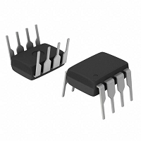

## Eller Hvordan sette sammen "Red Monkey" ?

(Jeg antar at du kanskje har hoppet hit allerede, men det er greit så lenge du ikke monterer noen komponenter feil vei).

1) Monter R3,R4,R6 og R7. Det er enklest hvis du bøyer ledningene på motstandene litt og så stikker begge endene ned i hvert sitt hull på kretskortet samtidig. Bøy så ledningene litt ut på den andre siden av kortet (bilde bløy, forside, bakside). Det er tekst på kretskortet som viser hvor de skal sitte.

|Steg 1|Steg 2|Steg 3|
|-|-|-|
|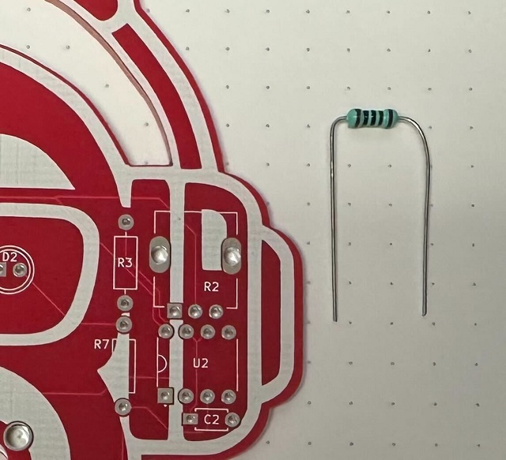|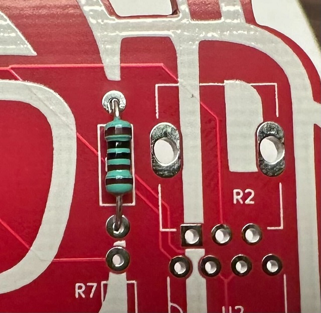|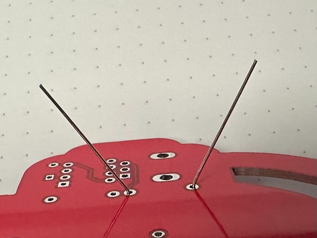|

Snu kortet slik at baksiden ligger opp og lodd fast ledningene som stikker ut. Etterpå, så klipper du av de ekstra pinnene.

|Steg 4|Steg 5|
|-|-|
|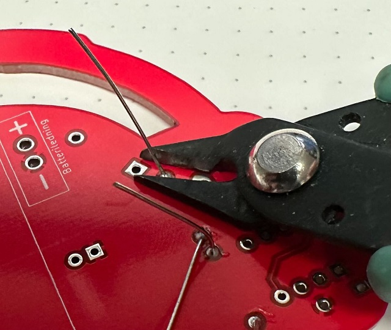|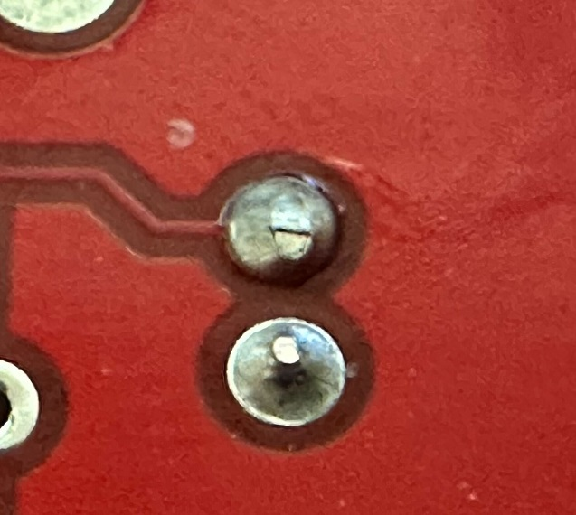|

Gratulerer. Du kan nå lodde. Klapp deg selv på skulderen. Bra jobba! (men vi er ikke helt ferdige ennå)

2. Det neste  er å montere lysdioder i øynene. Dette er de helt gjennomsikrige komponentene. 

> NB ! Pass på at den flate siden på lysdioden står riktig vei i forhold til hvordan D1 og D2 er tegnet på kretskortet. Flat side på lysdioden skal mot flat side på tegningen for at Red Monkey skal kunne ha lys i øynene.

Sett lysdiodene (D1 og D2) på plass og bøy ut ledningene bak, før du lodder de fast og så klipper av de overflødige ledningene.

|Steg 6|Steg 7|Steg 8|
|-|-|-|
||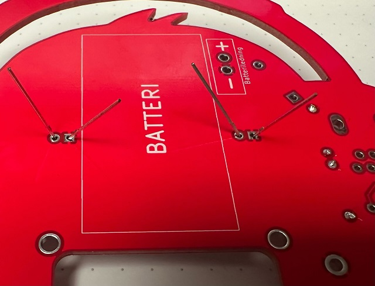|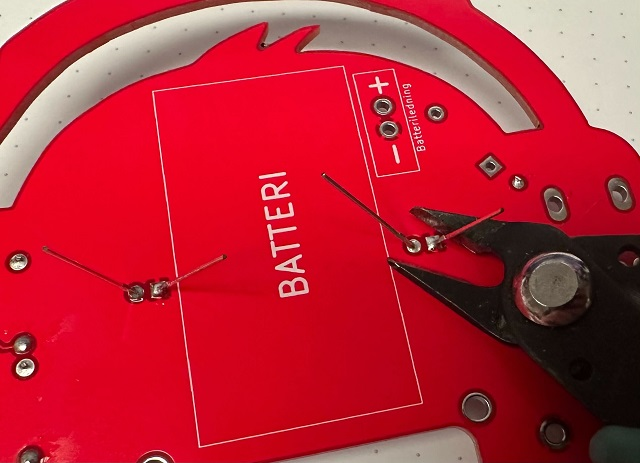|

3. Så skal vi montere kondensatorene. Det er viktig at ikke C1 og C2 bytter plass. C1 må monteres der det står "C1" på kretskortet og C2 må monteres på plassen til "C2" (De ser helt identiske ut, men de har forskjellig verdi).

Bøy ut ledningene på baksiden, snu kortet, lodd dem fast og klipp av på samme måte som før.

|Steg 9 (C1)|Steg 10 (C2)|
|-|-|
|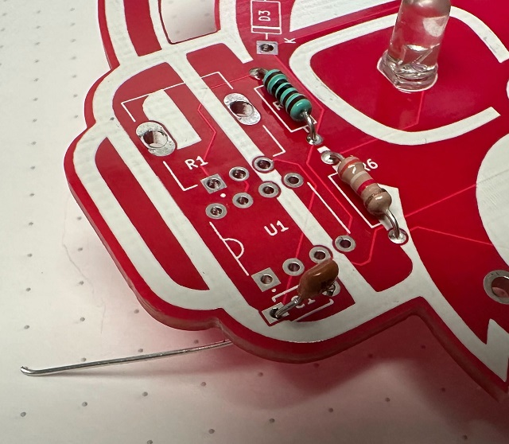|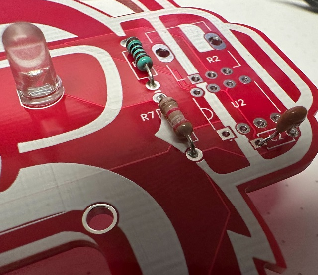|

Vi skal nå montere soklene til de integrerte kretsene. Disse gjør at vi lett kan bytte ut kretsene senere hvis de skulle bli ødelagt (De er veldig vanskelige å lodde av igjen hvis vi lodder dem rett p[ kortet])

> Soklene har et lite hakk i siden. Pass på at dette står på samme side som markeringen på kretskortet.

Disse har mye kortere pinner, men du kan likvele bøye pinnene på baksiden forsiktig ut med fingeren, slik at de henger fast når du skal snu kortet på hodet for å lodde de fast.

|Steg 11|Steg 12|Steg 13 & 14|
|-|-|-|
|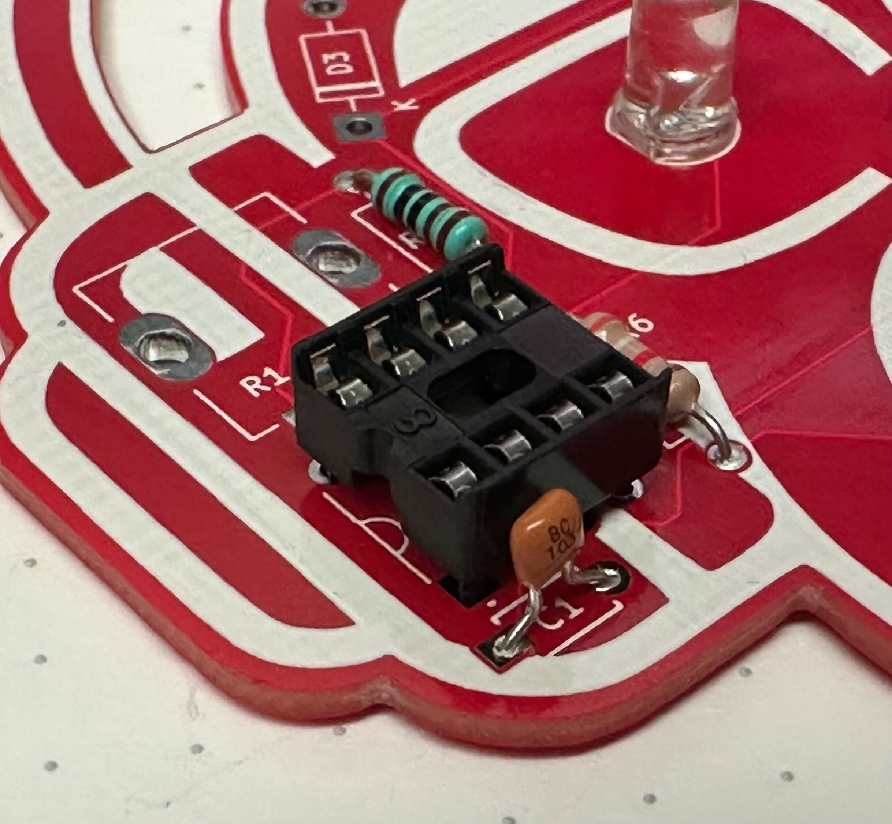|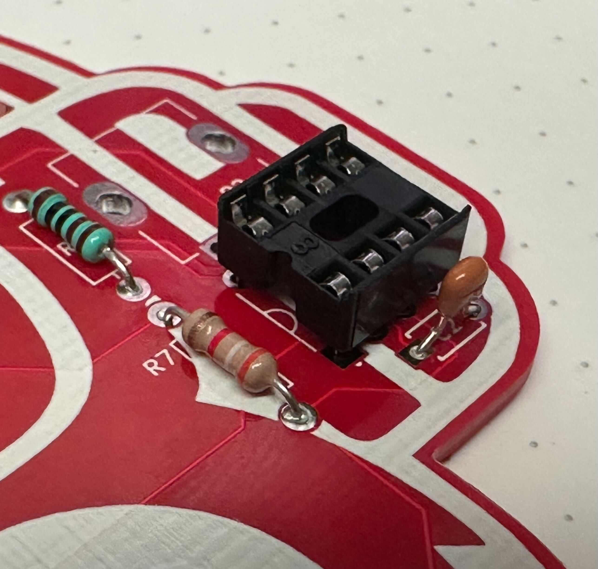|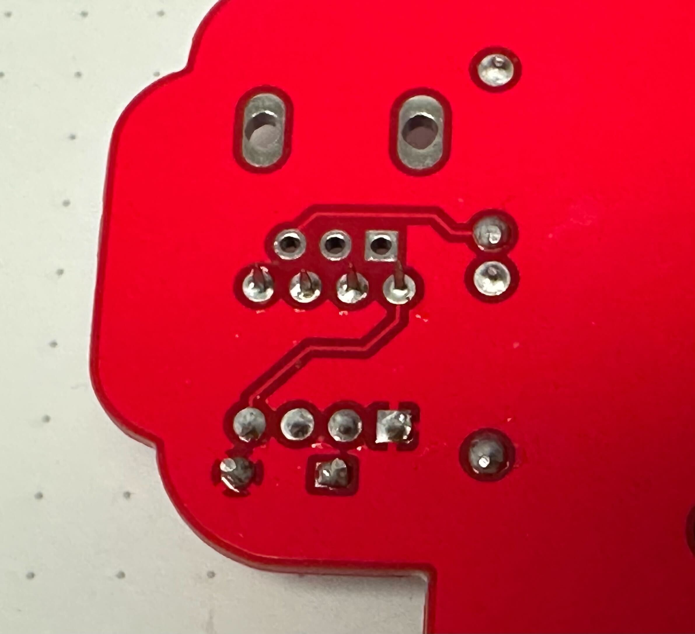|

Du kan nå sette inn 555-kretsene (innpakket i grå/sølvfarget folie). Dette er det vanskeligste trinnet, så du må være litt forsiktig.

Plasser den ene raden pinner i mot sokkelen først. Deretter holder du på hver side og "lirker" den andre raden av pinner på plass på sin side. Vær forsiktig og ikke trykk for hardt, siden pinnene da kan bøye seg eller treffe utenfor sokkelen. Pass  på at alle pinnene  hvert sitt hull i sokkelen.

> NB! Pass på at den blanke sirkelen ved en av pinnene er på samme side som "hakket" / merket på siden av sokkelen. (Hvis du setter den inn feil vei, så vil den sannsynelig bli ødelagt når du senere kobler til batteriet)

|Steg 15|Steg 16|resultat (Steg 17)|
|-|-|-|
|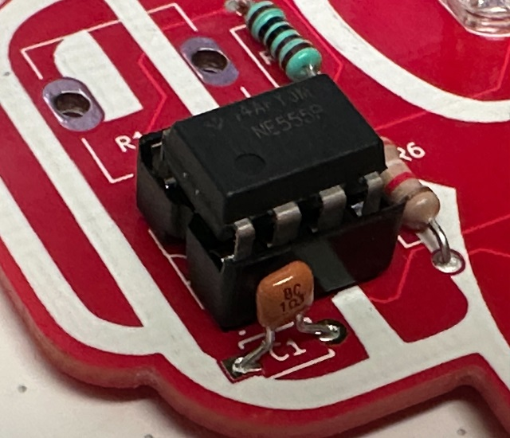|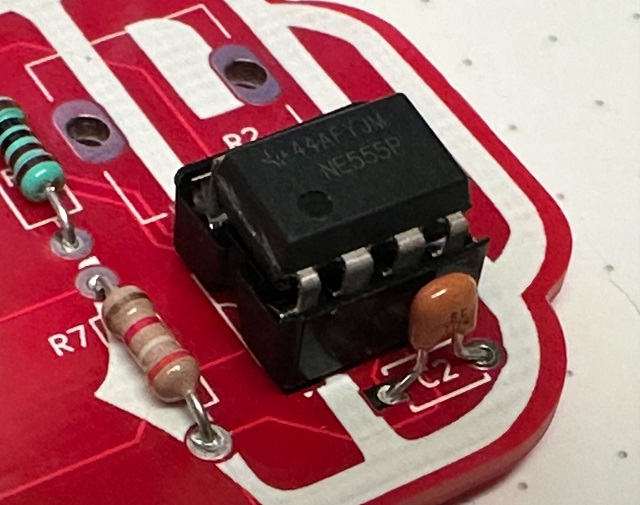|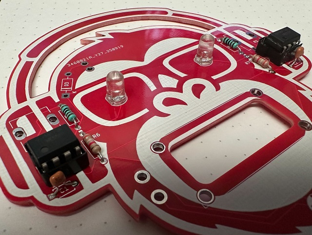|

Det neste steget er å montere potentiometrene (R1 & R2). Disse kan bare monteres en vei og det er det samme hvilket du monterer hvor, siden de er identiske.

Sikt på de tre midterste pinnene først, slik at disse er nede i hullene sine. Deretter presser du litt på de to festeørene på siden og klemmer dem ned på kretskortet før du lodder på baksiden

|Steg 18|Steg 19|Steg 20|
|-|-|-|
|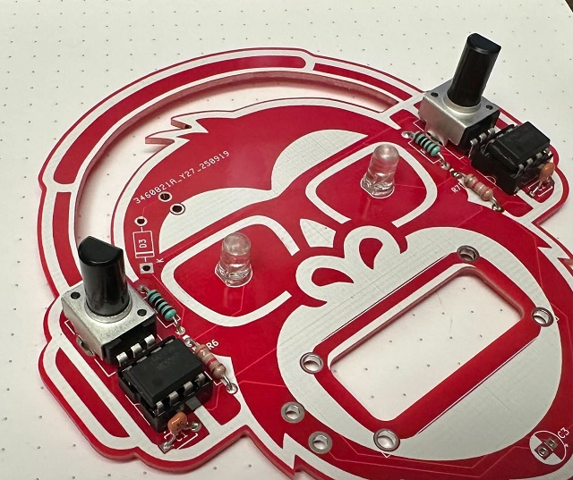|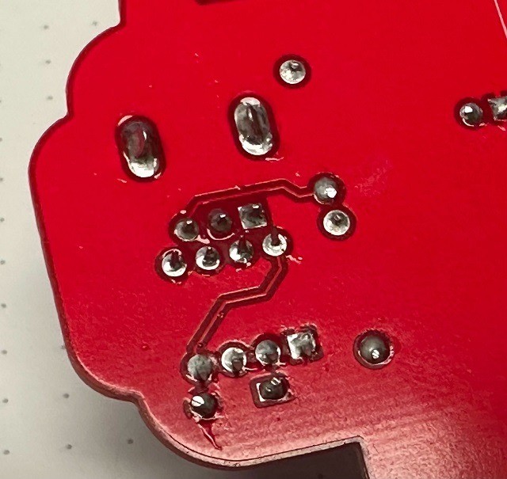|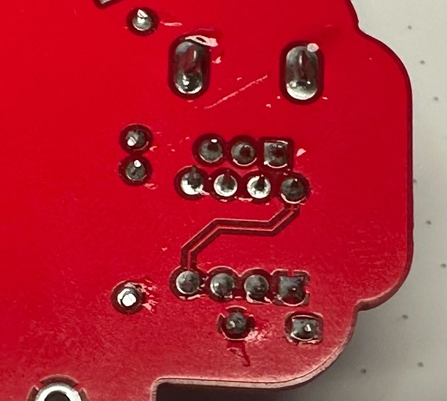|

Dee neste komponentene vi skal montere er D3 og C3. (D3 skal beskytte kretskortet vårt i fall noen skulle putte inn batteriet feil vei.)

> For D3, så pass på at den hvite stripen på dioden står på samme side som den hvite stripen på symbolet på kretskortet.

> For C3, så pass på at "-" på kondensatoren (merket på siden) peker mot det hvite feltet i sirkelen

Bøy pinnene, monter, bøy pinnene ut, lodd på plass og klipp av på vanlig måte.

|Steg 21|Steg 22|
|-|-|
|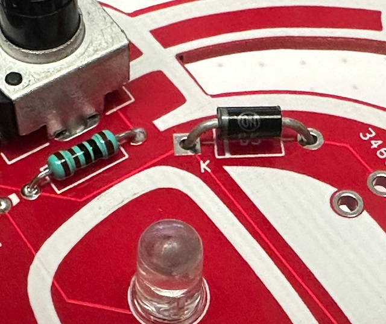|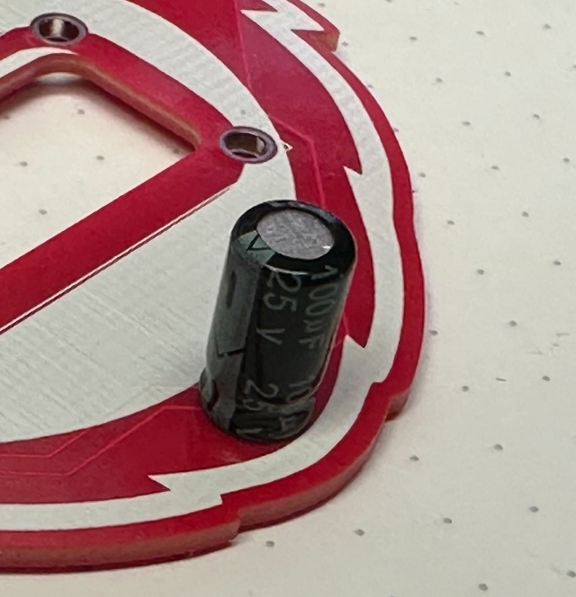|

Helt til slutt, så skal vi skru fast høyttaleren og lodde fast ledningene til denne. (Du vil nå trenge et lite stjerneskrujern)

Hold høyttaleren på baksiden av kretskortet og stikk inn en av skruene fra oversiden. Skru den helt inn i et av hullene i høyttaleren. Fortsett så med de andre skruene inntil alle er festet. Skru litt med fingrene først og bruk deretter skrujern for å feste den helt.

Snu deretter kretskortet på hodet. Lodd så en ledning mellom hver av terminalene på høyttaleren og  hullene i kretskortet på siden av høyttaleren.

Du skal nå montere de integrerte kretsene. Disse finner du pakket inn i grå sølvfarget plast. Vær forsiktig når du pakker opp disse. De har 8 bein hver (har du er kort der soklene allerede er loddet på, så dytter du de forsikrig inn i soklene. Pass på at alle beina treffer og at de står riktig vei (bilde) (hvis soklene ikke er montert, så lodde vi på disse først (se bilde for hvilken vei de skal stå)

|Steg 23|Steg 24|
|-|-|
|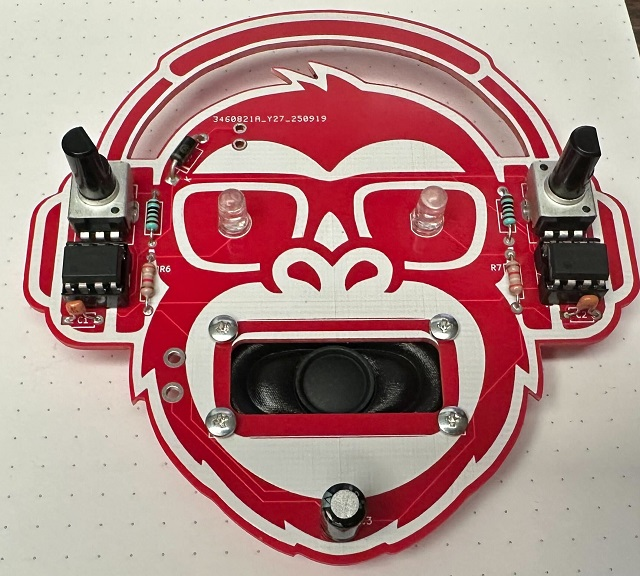|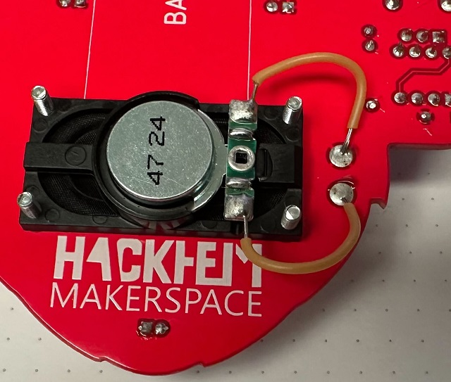|

Det helt siste skrittet er å lodde fast batterikontakten på baksiden av kortet.

> Rød ledning loddes til "+" og svart ledning til "-"

Batteriet eller batteripakken kan så festes på baksiden med dobbeltsidig tape. Når du kobler til batteriet, vil Red Moneky begynne å lage lyd. Ved å vri på de svarte knottene på potmetrene, så kan du så eksperimentere videre (og sannsynligvis drive lærere og foreldre til vanvidd hvis du bruker et 9V batteri)

Bra jobba!

### Referanser

Kretsen som ligger til grunn i dette byggesettet ble først beskrevet av Forrest Mimms i 1979. Du finner den igjen i boken "The Forrest Mimms Engineer's Notebook", sammen med masse andre forskjellige kretser. Mange av disse kan dessverre ikke bygges i dag, siden flere av komponentene som brukes der ikke produseres lenger. "555" er et unntak.)

